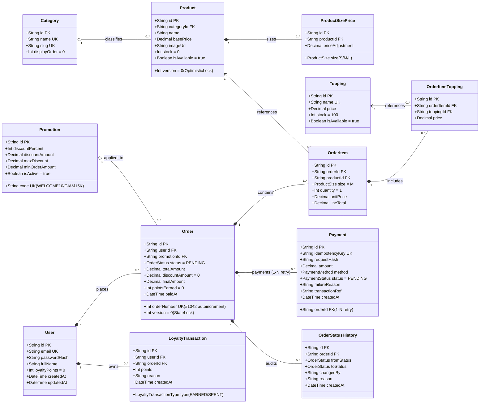

# 🗄️ BẢNG THIẾT KẾ CƠ SỞ DỮ LIỆU & SƠ ĐỒ UML DATABASE (BREWLITE - FULL SCHEMA)

Tài liệu này đặc tả toàn bộ mô hình dữ liệu quan hệ (Relational Database) và Sơ đồ Lớp / Thực thể chuẩn UML của hệ thống **BrewLite**, đã được kiểm tra và đồng bộ trực tiếp với **PostgreSQL qua Prisma ORM 6.19**, đáp ứng trọn vẹn 100% yêu cầu cho cả 3 Sprint.

---

## 1. SƠ ĐỒ UML DATABASE DIAGRAM (MERMAID)

---

## 2. BẢNG MÔ TẢ CHI TIẾT 10 THỰC THỂ CỐT LÕI (FULL SCHEMA)

### 2.1. Bảng `users` (Tài khoản người dùng & Tích lũy)
* **Khóa chính:** `id` (`cuid`, varchar 36)
* **Nghiệp vụ:** Quản lý đăng ký, đăng nhập JWT (Task 7) và lưu điểm thưởng tích lũy (Task 10).

| Cột | Kiểu | Ràng buộc | Mục đích nghiệp vụ |
| :--- | :--- | :--- | :--- |
| `id` | `VARCHAR(36)` | **PK** | Định danh duy nhất người dùng. |
| `email` | `VARCHAR(255)` | **UK, NOT NULL** | Email đăng nhập hệ thống. |
| `password_hash` | `VARCHAR(255)` | **NOT NULL** | Mật khẩu băm an toàn bằng `bcrypt` (Salt round 10). |
| `full_name` | `VARCHAR(100)` | NULLABLE | Tên hiển thị của khách hàng. |
| `loyalty_points`| `INTEGER` | **DEFAULT 0** | Số dư điểm thưởng hiện tại. |
| `created_at` | `TIMESTAMP` | **DEFAULT NOW()** | Thời gian đăng ký. |
| `updated_at` | `TIMESTAMP` | **DEFAULT NOW()** | Thời gian cập nhật gần nhất. |

---

### 2.2. Bảng `categories` (Phân loại đồ uống)
| Cột | Kiểu | Ràng buộc | Mục đích nghiệp vụ |
| :--- | :--- | :--- | :--- |
| `id` | `VARCHAR(36)` | **PK** | Mã danh mục. |
| `name` | `VARCHAR(100)` | **UK, NOT NULL** | Tên loại: "Cà phê", "Trà & Trái cây". |
| `slug` | `VARCHAR(100)` | **UK, NOT NULL** | Đường dẫn thân thiện (`ca-phe`, `tra-trai-cay`). |
| `display_order` | `INTEGER` | **DEFAULT 0** | Thứ tự hiển thị trên Menu. |

---

### 2.3. Bảng `products` (Danh mục sản phẩm & Tồn kho Concurrency)
* **Nghiệp vụ:** Hiển thị Menu (Task 2, 3), kiểm soát tồn kho đồng thời với **Optimistic Locking** (Task 10).

| Cột | Kiểu | Ràng buộc | Mục đích nghiệp vụ |
| :--- | :--- | :--- | :--- |
| `id` | `VARCHAR(36)` | **PK** | Mã sản phẩm. |
| `category_id` | `VARCHAR(36)` | **FK -> categories(id)** | Phân loại danh mục. |
| `name` | `VARCHAR(150)` | **NOT NULL** | Tên món (Cà phê sữa đá, Americano, Cappuccino, Trà đào). |
| `base_price` | `DECIMAL(12,0)`| **NOT NULL** | Giá gốc đồ uống (VNĐ). |
| `image_url` | `VARCHAR(500)` | NULLABLE | Link ảnh món đồ uống. |
| `stock` | `INTEGER` | **DEFAULT 0** | Số lượng ly/nguyên liệu còn lại trong kho. |
| `version` | `INTEGER` | **DEFAULT 0** | **Cột Optimistic Lock:** Ngăn chặn overselling khi nhiều khách đặt cùng lúc. |
| `is_available` | `BOOLEAN` | **DEFAULT TRUE** | Còn bán hay tạm hết. |

---

### 2.4. Bảng `product_size_prices` (Phụ phí theo Size S/M/L - Task 4)
| Cột | Kiểu | Ràng buộc | Mục đích nghiệp vụ |
| :--- | :--- | :--- | :--- |
| `id` | `VARCHAR(36)` | **PK** | Định danh dòng giá size. |
| `product_id` | `VARCHAR(36)` | **FK -> products(id)** | Món đồ uống áp dụng. |
| `size` | `ENUM` | **'S', 'M', 'L'** | Size ly. |
| `price_adjustment`| `DECIMAL(12,0)`| **DEFAULT 0** | Số tiền phụ thu (S: +0đ, M: +5.000đ, L: +10.000đ). |

---

### 2.5. Bảng `toppings` (Danh mục Topping chọn thêm - Task 4)
| Cột | Kiểu | Ràng buộc | Mục đích nghiệp vụ |
| :--- | :--- | :--- | :--- |
| `id` | `VARCHAR(36)` | **PK** | Mã topping. |
| `name` | `VARCHAR(100)` | **UK, NOT NULL** | Tên topping: "Trân châu trắng", "Kem Cheese", "Đào miếng". |
| `price` | `DECIMAL(12,0)`| **NOT NULL** | Đơn giá thêm (5.000đ, 10.000đ, 8.000đ). |
| `stock` | `INTEGER` | **DEFAULT 100** | Tồn kho topping. |
| `is_available` | `BOOLEAN` | **DEFAULT TRUE** | Trạng thái còn topping không. |

---

### 2.6. Bảng `promotions` (Mã giảm giá Khuyến mãi - Task 10)
| Cột | Kiểu | Ràng buộc | Mục đích nghiệp vụ |
| :--- | :--- | :--- | :--- |
| `id` | `VARCHAR(36)` | **PK** | Mã bản ghi voucher. |
| `code` | `VARCHAR(50)` | **UK, NOT NULL** | Mã nhập: `WELCOME10`, `GIAM15K`. |
| `description` | `VARCHAR(255)` | NULLABLE | Mô tả thể lệ khuyến mãi. |
| `discount_percent`| `INTEGER` | NULLABLE | Phần trăm giảm giá (ví dụ 10%). |
| `discount_amount` | `DECIMAL(12,0)`| NULLABLE | Số tiền giảm cố định (ví dụ 15.000đ). |
| `max_discount` | `DECIMAL(12,0)`| NULLABLE | Mức giảm tối đa (ví dụ 20.000đ). |
| `min_order_amount`| `DECIMAL(12,0)`| **DEFAULT 0** | Giá trị đơn tối thiểu để áp dụng mã. |
| `is_active` | `BOOLEAN` | **DEFAULT TRUE** | Mã còn hiệu lực kích hoạt hay không. |

---

### 2.7. Bảng `orders` (Quản lý đơn hàng & State Machine)
| Cột | Kiểu | Ràng buộc | Mục đích nghiệp vụ |
| :--- | :--- | :--- | :--- |
| `id` | `VARCHAR(36)` | **PK** | Mã UUID nội bộ của đơn. |
| `order_number` | `INTEGER` | **UK, AUTOINCREMENT** | Mã đơn hiển thị giao diện: `#1001`, `#1042`. |
| `user_id` | `VARCHAR(36)` | **FK -> users(id)** | Khách hàng đặt đơn. |
| `promotion_id` | `VARCHAR(36)` | **FK -> promotions(id)** | Mã voucher được áp dụng (nếu có). |
| `status` | `ENUM` | **DEFAULT 'PENDING'** | Trạng thái: `PENDING`, `PAID`, `PREPARING`, `READY`, `COMPLETED`, `PAYMENT_FAILED`, `CANCELLED`. |
| `total_amount` | `DECIMAL(12,0)`| **NOT NULL** | Tổng tiền tạm tính ban đầu. |
| `discount_amount`| `DECIMAL(12,0)`| **DEFAULT 0** | Số tiền được giảm giá. |
| `final_amount` | `DECIMAL(12,0)`| **NOT NULL** | Số tiền thực trả (`totalAmount - discountAmount`). |
| `points_earned` | `INTEGER` | **DEFAULT 0** | Số điểm tích lũy được sau khi đơn `PAID`. |
| `paid_at` | `TIMESTAMP` | NULLABLE | Thời điểm thanh toán thành công. |
| `version` | `INTEGER` | **DEFAULT 0** | Khóa phiên bản chống xung đột trạng thái đơn hàng. |

---

### 2.8. Bảng `order_items` & `order_item_toppings` (Chi tiết dòng đơn)
* Lưu trữ từng ly nước được đặt, size đã chọn và mảng các topping liên kết qua bảng trung gian `order_item_toppings`.

---

### 2.9. Bảng `payments` (Lịch sử thanh toán & Idempotency - Task 8 & 10)
* **Khóa chính:** `id` (CUID)
* **Quan hệ:** **1 Order có nhiều Payment (1–N)**: Hỗ trợ trường hợp thanh toán thất bại lần 1, khách hàng thực hiện thanh toán lại mà không vi phạm ràng buộc Unique.

| Cột | Kiểu | Ràng buộc | Mục đích nghiệp vụ |
| :--- | :--- | :--- | :--- |
| `id` | `VARCHAR(36)` | **PK** | Mã giao dịch thanh toán nội bộ. |
| `order_id` | `VARCHAR(36)` | **FK -> orders(id)** | Đơn hàng cần thanh toán. |
| `idempotency_key`| `VARCHAR(64)` | **UK, NOT NULL** | **Khóa Idempotency:** Ngăn chặn trừ tiền 2 lần khi gửi cùng request. |
| `request_hash` | `VARCHAR(64)` | NULLABLE | Hash nội dung request để kiểm tra payload. |
| `amount` | `DECIMAL(12,0)`| **NOT NULL** | Số tiền giao dịch. |
| `method` | `ENUM` | **'E_WALLET', 'BANK_CARD'** | Phương thức thanh toán (Ví / Thẻ). |
| `status` | `ENUM` | **'PENDING', 'SUCCESS', 'FAILED'** | Trạng thái giao dịch. |
| `failure_reason` | `VARCHAR(255)`| NULLABLE | Nguyên nhân lỗi khi thất bại. |
| `transaction_ref`| `VARCHAR(100)` | NULLABLE | Mã đối soát từ Cổng thanh toán. |

---

### 2.10. Bảng `loyalty_transactions` & `order_status_history` (Audit Trail)
* `loyalty_transactions`: Lưu lịch sử cộng/trừ điểm thưởng của khách sau khi đơn `PAID`.
* `order_status_history`: Lưu vết audit lịch sử chuyển trạng thái đơn (`PENDING` -> `PAID` -> `PREPARING` -> `READY` -> `COMPLETED`) kèm người thực hiện và lý do.
