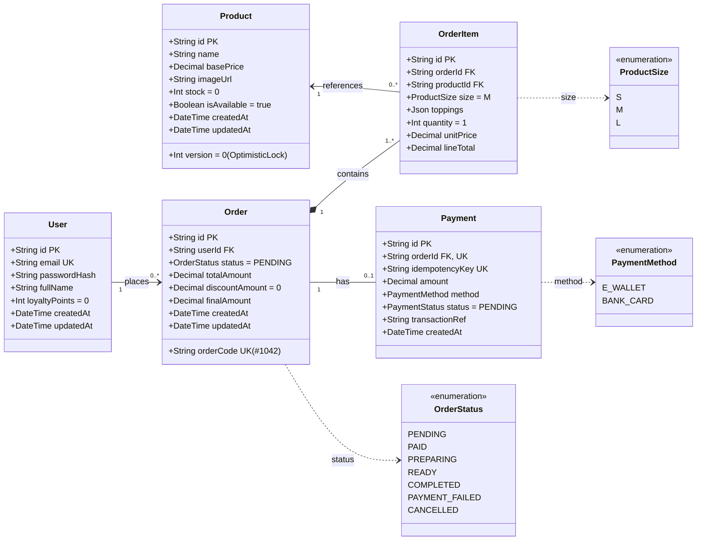

# 🗄️ BẢNG THIẾT KẾ CƠ SỞ DỮ LIỆU & SƠ ĐỒ UML DATABASE (BREWLITE)

Tài liệu này đặc tả toàn bộ mô hình dữ liệu quan hệ (Relational Database) và Sơ đồ Lớp / Thực thể chuẩn UML của hệ thống **BrewLite**, được đồng bộ trực tiếp với **PostgreSQL qua Prisma ORM**.

---

## 1. SƠ ĐỒ UML DATABASE DIAGRAM (MERMAID)

---

## 2. BẢNG MÔ TẢ CHI TIẾT CÁC THỰC THỂ (TABLE SCHEMAS)

### 2.1. Bảng `users` (Tài khoản khách hàng & Tích điểm)
* **Khóa chính:** `id` (CUID, string 30 ký tự)
* **Mục đích:** Lưu thông tin đăng nhập, mật khẩu băm và điểm thưởng tích lũy (Task 7 & 10).

| Tên cột | Kiểu dữ liệu | Ràng buộc (Constraint) | Mô tả |
| :--- | :--- | :--- | :--- |
| `id` | `VARCHAR(36)` | **PRIMARY KEY** | Mã định danh duy nhất của người dùng |
| `email` | `VARCHAR(255)` | **UNIQUE, NOT NULL** | Email dùng để đăng nhập hệ thống |
| `password_hash` | `VARCHAR(255)` | **NOT NULL** | Mật khẩu được băm an toàn bằng `bcrypt` |
| `full_name` | `VARCHAR(100)` | NULLABLE | Tên hiển thị của khách hàng |
| `loyalty_points`| `INTEGER` | **DEFAULT 0** | Điểm tích lũy, cộng tự động sau khi đơn `PAID` |
| `created_at` | `TIMESTAMP` | **DEFAULT NOW()** | Thời gian đăng ký tài khoản |
| `updated_at` | `TIMESTAMP` | **DEFAULT NOW()** | Thời gian cập nhật gần nhất |

---

### 2.2. Bảng `products` (Danh mục đồ uống & Quản lý tồn kho)
* **Khóa chính:** `id` (CUID)
* **Mục đích:** Lưu thông tin menu sản phẩm và cột `version` hỗ trợ **Optimistic Locking** chống overselling khi đặt đồng thời (Task 2 & 10).

| Tên cột | Kiểu dữ liệu | Ràng buộc | Mô tả |
| :--- | :--- | :--- | :--- |
| `id` | `VARCHAR(36)` | **PRIMARY KEY** | Mã định danh sản phẩm |
| `name` | `VARCHAR(150)` | **NOT NULL** | Tên đồ uống (Cà phê sữa, Americano,...) |
| `base_price` | `DECIMAL(10,2)`| **NOT NULL** | Đơn giá cơ bản (size S) |
| `image_url` | `VARCHAR(500)` | NULLABLE | Đường dẫn hình ảnh hiển thị trên app |
| `stock` | `INTEGER` | **DEFAULT 0, CHECK (stock >= 0)** | Số lượng ly/nguyên liệu còn lại trong kho |
| `version` | `INTEGER` | **DEFAULT 0** | **Optimistic Locking Version:** Tăng +1 mỗi khi cập nhật tồn kho |
| `is_available` | `BOOLEAN` | **DEFAULT TRUE** | Trạng thái còn mở bán hay tạm hết |
| `created_at` | `TIMESTAMP` | **DEFAULT NOW()** | Ngày tạo món |
| `updated_at` | `TIMESTAMP` | **DEFAULT NOW()** | Ngày cập nhật |

---

### 2.3. Bảng `orders` (Quản lý đơn hàng & State Machine)
* **Khóa chính:** `id` (CUID)
* **Mục đích:** Theo dõi chu trình sống của đơn hàng theo Order State Machine (Task 6 & 10).

| Tên cột | Kiểu dữ liệu | Ràng buộc | Mô tả |
| :--- | :--- | :--- | :--- |
| `id` | `VARCHAR(36)` | **PRIMARY KEY** | Mã đơn hàng nội bộ |
| `order_code` | `VARCHAR(20)` | **UNIQUE, NOT NULL** | Mã đơn hiển thị cho khách/quầy (ví dụ `#1042`) |
| `user_id` | `VARCHAR(36)` | **FOREIGN KEY -> users(id)** | Khách hàng đặt đơn |
| `status` | `ENUM OrderStatus`| **DEFAULT 'PENDING'** | Trạng thái đơn (`PENDING`, `PAID`, `PREPARING`, `READY`, `COMPLETED`, `PAYMENT_FAILED`, `CANCELLED`) |
| `total_amount`| `DECIMAL(10,2)`| **NOT NULL** | Tổng tiền tạm tính trước giảm |
| `discount_amount`| `DECIMAL(10,2)`| **DEFAULT 0** | Tiền được giảm giá (Voucher / Điểm thưởng) |
| `final_amount`| `DECIMAL(10,2)`| **NOT NULL** | Số tiền thực tế phải thanh toán |
| `created_at` | `TIMESTAMP` | **DEFAULT NOW()** | Thời điểm đặt đơn |
| `updated_at` | `TIMESTAMP` | **DEFAULT NOW()** | Thời điểm cập nhật trạng thái |

---

### 2.4. Bảng `order_items` (Chi tiết từng món trong đơn)
* **Khóa chính:** `id` (CUID)
* **Khóa ngoại:** `order_id` (trỏ `orders`), `product_id` (trỏ `products`)
* **Mục đích:** Lưu món, size đã chọn (S/M/L) và danh sách topping đính kèm (Task 4 & 6).

| Tên cột | Kiểu dữ liệu | Ràng buộc | Mô tả |
| :--- | :--- | :--- | :--- |
| `id` | `VARCHAR(36)` | **PRIMARY KEY** | Mã dòng chi tiết đơn |
| `order_id` | `VARCHAR(36)` | **FOREIGN KEY -> orders(id) ON DELETE CASCADE** | Mã đơn chứa dòng này |
| `product_id` | `VARCHAR(36)` | **FOREIGN KEY -> products(id)** | Sản phẩm được chọn |
| `size` | `ENUM ProductSize`| **DEFAULT 'M'** | Size ly: `'S'`, `'M'`, `'L'` |
| `toppings` | `JSONB` | NULLABLE | Mảng topping chọn kèm (`[{"name": "Trân châu", "price": 5000}]`) |
| `quantity` | `INTEGER` | **DEFAULT 1, CHECK (quantity > 0)** | Số lượng đặt |
| `unit_price` | `DECIMAL(10,2)`| **NOT NULL** | Đơn giá một ly (đã gồm phụ thu size + topping) |
| `line_total` | `DECIMAL(10,2)`| **NOT NULL** | Thành tiền (`unit_price * quantity`) |

---

### 2.5. Bảng `payments` (Lịch sử thanh toán & Idempotency)
* **Khóa chính:** `id` (CUID)
* **Khóa ngoại:** `order_id` (UNIQUE, quan hệ 1-1 với đơn hàng)
* **Mục đích:** Chống duplicate charge qua `idempotency_key` duy nhất và lưu trạng thái thanh toán (Task 8 & 10).

| Tên cột | Kiểu dữ liệu | Ràng buộc | Mô tả |
| :--- | :--- | :--- | :--- |
| `id` | `VARCHAR(36)` | **PRIMARY KEY** | Mã giao dịch thanh toán |
| `order_id` | `VARCHAR(36)` | **FOREIGN KEY -> orders(id), UNIQUE** | Mỗi đơn tương ứng 1 bản ghi thanh toán |
| `idempotency_key`| `VARCHAR(64)` | **UNIQUE, NOT NULL** | **Khóa Idempotency** (Header gửi từ client chống thanh toán trùng 2 lần) |
| `amount` | `DECIMAL(10,2)`| **NOT NULL** | Số tiền thanh toán |
| `method` | `ENUM PaymentMethod`| **NOT NULL** | `'E_WALLET'` hoặc `'BANK_CARD'` |
| `status` | `ENUM PaymentStatus`| **DEFAULT 'PENDING'** | Trạng thái giao dịch (`PENDING`, `SUCCESS`, `FAILED`) |
| `transaction_ref`| `VARCHAR(100)` | NULLABLE | Mã tham chiếu trả về từ Cổng thanh toán giả lập |
| `created_at` | `TIMESTAMP` | **DEFAULT NOW()** | Thời điểm tạo giao dịch |

---

## 3. CÁC TÀI LIỆU & FILE SƠ ĐỒ ĐÃ TẠO

Toàn bộ các định dạng sơ đồ Database UML đã được lưu trong thư mục `docs/`:
1. [**`docs/database-uml.svg`**](file:///d:/MyProject/BrewLite/docs/database-uml.svg): Ảnh vector SVG vẽ chuẩn UML sắc nét, có thể chèn trực tiếp vào Word hoặc slide thuyết trình.
2. [**`docs/database-uml.puml`**](file:///d:/MyProject/BrewLite/docs/database-uml.puml): Mã nguồn PlantUML để dán vào [PlantText.com](https://www.planttext.com/) hoặc StarUML.
3. [**`backend/prisma/schema.prisma`**](file:///d:/MyProject/BrewLite/backend/prisma/schema.prisma): File mã nguồn Prisma đã đồng bộ và tạo bảng vật lý trong database Docker PostgreSQL.
